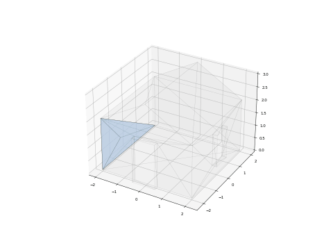

# Model Tetrahedralizer

A Python tool for generating a set of tetrahedrons representing the volume of a 3D model.



## Usage

```
python tetrahedralize.py [-h] [-o OUTPUT] [--skip-validation] [--inward] input

positional arguments:
  input                Input .obj file

options:
  -o, --output OUTPUT  Output file (default: tetras.txt)
  --skip-validation    Skip final result validation
  --inward             Generate tetrahedrons covering the closed space of a model (if your model is a room)
```

## Overview

### The Idea

**Tetrahedralization** is the process of decomposing a 3D model into a set of tetrahedra (4-point pyramids).

Just as a 3D model **shape** is represented by **triangles**, its **volume** can be represented by **tetrahedra**.

Tetrahedrons can be quite useful:
- They are **always convex**, which makes them easier to work with
- They are **well-suited for collision detection** algorithms such as GJK
- They **can be converted into a tetrahedral graph** and used for space partitioning (similar to BSP trees)
- They **can be animated** in the same way as we animate 3D models

### The Problem

However, robust tetrahedralization of arbitrary meshes is still a hard problem.

Existing approaches like [Delaunay tetrahedralization](https://www.cs.purdue.edu/homes/tamaldey/course/531/Delaunay%283D%29.pdf) tend to generate many excessive tetrahedra, which makes them inefficient for realtime simulations (e.g. video games).

### The Solution

My approach uses a simple growth-based heuristic:

1. Pick an arbitrary triangle from the model - this is the initial face of our tetrahedral mesh
2. "Grow" it into a tetrahedron by finding the closest vertex to the face center
3. Recursively "grow" newly created faces
4. Continue until the volume is closed

<details>
    <summary>Visualization</summary>
    https://github.com/user-attachments/assets/1d3bd834-7e25-4a1a-bf79-880dc06c6aaa
</details>

## Disclaimer

**Please note that all code in this repository is not production-ready solution. This approach is not sufficiently tested and optimized to be reliable and stable on all geometry types. I'm just experimenting and sharing the results in public domain.**
